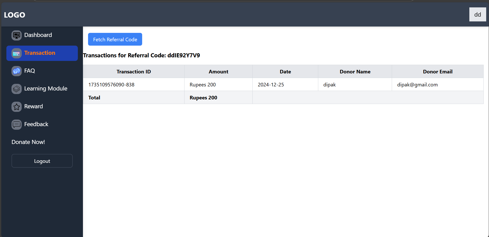
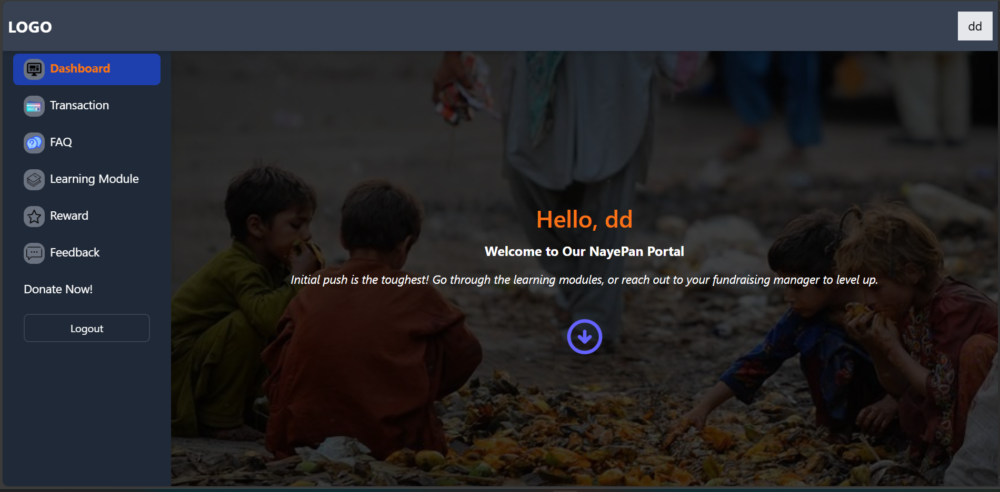
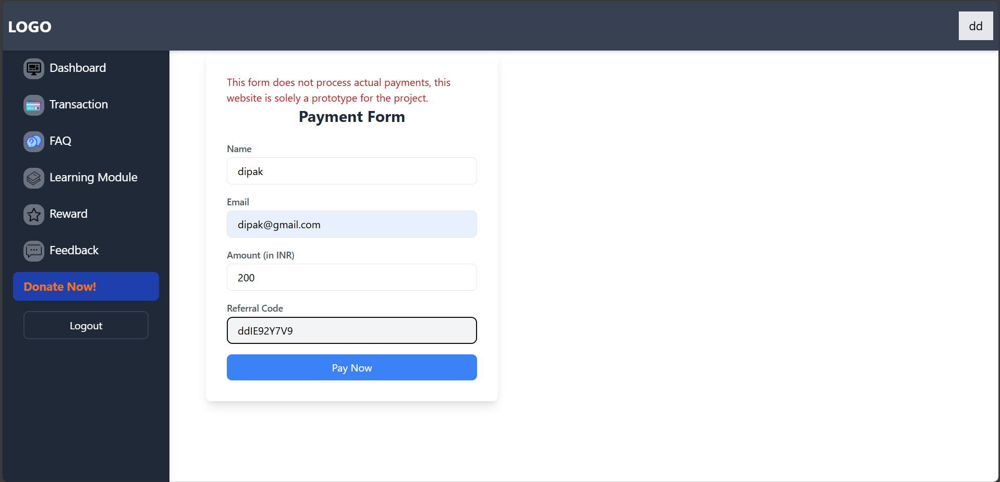
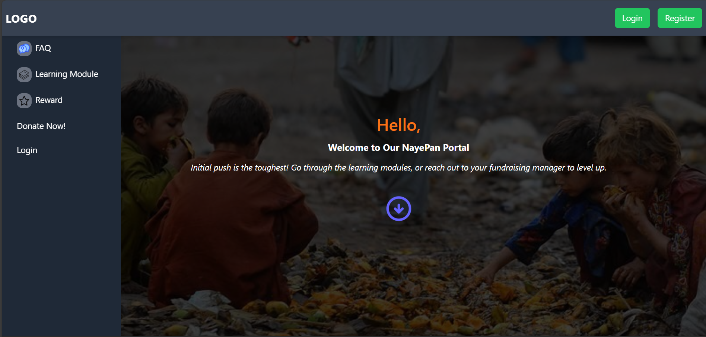

# NayePan Portal

Welcome to the **NayePan Portal** repository! This platform is designed to support users in their journey of making a positive impact through donations, rewards, and learning. Below is a detailed explanation of the features and purpose of the project.

## DEPLYOED WEBSITE LINK :- https://preeminent-rolypoly-c2e9fe.netlify.app/
---

## Project Overview
NayePan Portal is a comprehensive web platform that aims to bridge the gap between donors and those in need. It offers:

1. **Learning Modules**:
   - Educate users about safe and effective donation methods.
   - Provide resources on how to identify genuine causes and organizations.

2. **FAQ Section**:
   - Answer common questions about poverty, begging, and how to make a meaningful impact through donations.

3. **Transaction System**:
   - Track user donations based on their referral codes.
   - Display transaction details in a tabular format with total amounts calculated dynamically.

4. **Reward System**:
   - A system to incentivize users for their contributions (future enhancement).

5. **Feedback Mechanism**:
   - Allow users to submit feedback about the platform.
   - Feedback is visible only to the creator for privacy and better user management.

6. **Profile Section**:
   - Users can view their personal data like name and email.
   - A placeholder for future features.

---

## Technical Details
- **Frontend**:
  - Built with React.js and Tailwind CSS for a modern and responsive user interface.
  - Includes animations and dynamic elements for better user engagement.

- **Backend**:
  - Powered by Appwrite for user authentication, database management, and API integration.

- **Deployment**:
  - Hosted on Netlify for seamless and scalable deployment.

---

## Key Features

### 1. Learning Modules
The platform includes a section dedicated to educating users about:
- The importance of donating.
- Safe donation practices.
- How to verify causes before contributing.

### 2. FAQ Section
A detailed FAQ section addresses:
- Common questions about poverty and begging.
- How donations help.
- Steps to donate effectively.

### 3. Transactions
Users can:
- View transactions linked to their referral codes.
- See detailed transaction data in a user-friendly tabular format.
- View the total amount donated.


### 4. Feedback System
- Users can submit feedback to improve the platform.
- Only the feedback creator can view their entries.

### 5. Profile Section
- Displays basic user information such as name and email.
- Placeholder text indicates upcoming features.

---
### 6. Login/Register
- User Can login and Register with the credentials

### 7.Dashboard 
-user can see the dashboard


### 8.Donate
-there are demostrate the donate systeam 
-if you fill the form then it save the form in the database 


## 9. Referral System
-user can referral the code as well the link 

## Common page when user cant't login 


## Getting Started
### Prerequisites
- Node.js
- Appwrite account
- Netlify account (optional for deployment)

### Installation
1. Clone the repository:
   ```bash
   git clone <repository-url>
   ```
2. Install dependencies:
   ```bash
   npm install
   ```
3. Configure Appwrite settings:
   - Update the Appwrite client configuration in the project.

4. Start the development server:
   ```bash
   npm start
   ```
## database integration
-create the database with some name and add the database key to the .env file
-create collection with some name like (feedback,transaction_data, referral_code)
-create the attribute for the feedback is (feedback	,user_id)
-for the transaction_data (referral_id,	donar_name,	donar_email_id,	order_id,	amount)
-for the referral_code (referral_user_id	referral_code)

## Future Enhancements
- Complete the reward system.
- Add advanced analytics for donations.
- Implement multilingual support.
- Integrate with more payment gateways.

---

---

## License
This work is licensed under the [Creative Commons Attribution-NonCommercial-NoDerivatives 4.0 International License](http://creativecommons.org/licenses/by-nc-nd/4.0/).

